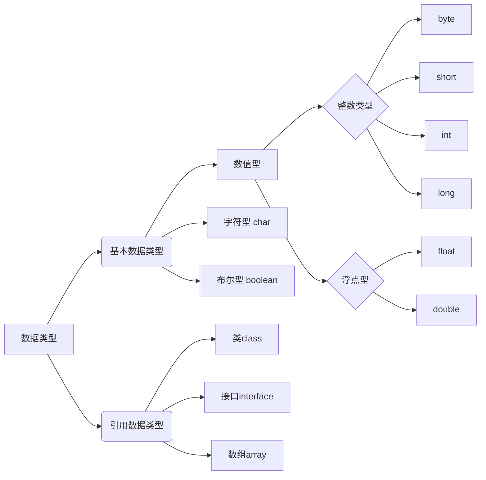
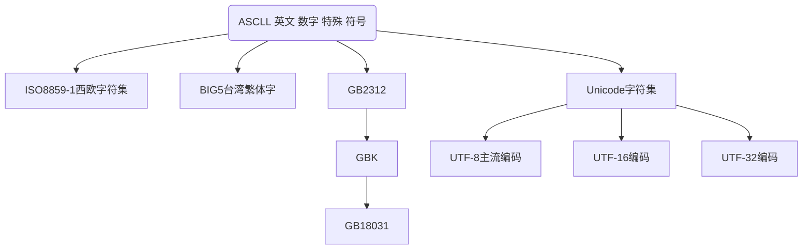

# 目录

<!-- toc -->


# 二进制

二进制，是计算技术中广泛采用的一种[数制，](https://baike.baidu.com/item/%E6%95%B0%E5%88%B6/217113)由德国数理哲学大师莱布尼茨于 1679 年发明。
[二进制数](https://baike.baidu.com/item/%E4%BA%8C%E8%BF%9B%E5%88%B6%E6%95%B0)据是用 0 和 1 两个[数码](https://baike.baidu.com/item/%E6%95%B0%E7%A0%81/552177)来表示的数。它的基数为 2，进位规则是“逢二进一”。
数字计算机只能[识别和](https://baike.baidu.com/item/%E8%AF%86%E5%88%AB)[处理](https://baike.baidu.com/item/%E5%A4%84%E7%90%86)由‘0’.‘1’符号串组成的[代码](https://baike.baidu.com/item/%E4%BB%A3%E7%A0%81)。其运算模式正是二进制。

| 十进制数 | 二进制 |
| -------- | ------ |
| 0        | 0      |
| 1        | 1      |
| 2        | 10     |
| 3        | 11     |
| 4        | 100    |
| 5        | 101    |
| 6        | 110    |
| 7        | 111    |
| 8        | 1000   |
| 9        | 1001   |
| 10       | 1010   |
| 11       | 1011   |
| 12       | 1100   |
| 13       | 1101   |
| 14       | 1110   |
| 15       | 1111   |


```java
public class welcome{
    public static void main(String[] args){
              System.out.print("helo word");
    }   
}
```

1. Java对大小写敏感

2. 关键字cass的意思是类。Java是面向对象的语言,所有代码必须位于类里面

3. 源文件编译后,得相应的字节码文件,编译器为每个类生成独立的字节码文件

4. main方法是Java应用程序的入口方法,格式固定

   `public static void main( Stringl args)`

5. 一个源文件可以包含多个类，每个类都包含一个字节码文件

6. 每个语句必须以分号结束,回车不是语句的结束标志,所以一个语句可以跨多行。


# 注释


## 单行注释

 `//`


## 多行注释

`/*   */`


## 文档注释

`/**    */`


# 标识符

> 标识符是用来给变量、类、方法以及包进行命名的。4大规则

1. 必须以字母、下划线、美元符号$开头
2. 其它部分可以是字母、下划线“”、美元符“$″和数字的任意组合。
3. 大小写敏感,且长度无限制。
4. 不可以是Java的关键字。


**`标识符的使用规范`**

`✅表示类名的标识符:每个单词的首字母大写,如Man, Goodman`

`✅表示方法和变量的标识符:第一个单词小写,从第二个单词开始首字母大写,我们称之为驼峰原则”,如eatO, eatfoodo`

**Java不采用ASCll字符集,而是采用 Unicode字符集。**因此,这里字母的含义不仅仅是英文,还包括汉字等等。但是不建议大家使用汉字来定义标识符


**合法的标识符**

```java
int a=3;

int  _123=3;

int $12aa =3;

int 变量1=55;       //不建议使用中文命名的标识符
```


**不合法的标识符**

```java
int 1a=3;   //不能用数字开头

int a#=3;   //不能包含#这样的特殊字符

int int=3;  //能使用关键字
```


# java关键字/保留字


| abstract   | assert  | boolean   | break     | byte       | case         |
| ---------- | ------- | --------- | --------- | ---------- | ------------ |
| catch      | char    | class     | const     | continue   | default      |
| do         | double  | else      | extends   | final      | finally      |
| float      | for     | goto      | if        | implements | import       |
| instanceof | int     | interface | long      | native     | new          |
| null       | package | private   | protected | public     | return       |
| short      | static  | strictfp  | super     | switch     | synchronized |
| this       | throw   | throws    | transient | try        | void         |
| volatile   | while   |           |           |            |              |


**上面的单词，从实战思维出发，我们不需要刻意去记！随着学习的深入，自然就非常熟悉了**


# 变量

1. 变量本质上就是代表一个”可操作的存储空间”,空间位置是确定的,但是里面放置什么值不确定。

2. 可通过变量名来访问“对应的存储空间”,从而操纵这个“存储空间”存储的值

3. Java是一种**强类型语言**,**每个变量都必须声明其数据类型**。变量的数据类型决定了变量占据存储空间的大小。比如,int a=3;表示a变量的空间大小为4个字节

```java
public class TestVariable {
    public static void main(String[] args){
        int age =18;
        int b;    //只是声明了变量b，没有初始化
        int x=0,y=0,z=1;

        System.out.println(age);

        b=0;      //变量使用之前，必须初始化！
        System.out.println(b);
    }
}

🏃运行结果:
18
0
```


## 变量的分类和作用域

> 从整体上可将变量划分为**局部变量**、**成员变量**(也称为实例变量)和**静态变量**。


| 类型               | 声明位置            | 从属于      | 生命周期（作用域）                                           |
| ------------------ | ------------------- | ----------- | ------------------------------------------------------------ |
| 局部变量           | 方法或语句块内部    | 方法/语句块 | 从声明位置开始，直到方法或语句块执行完毕，局部变量消失       |
| 成员变量(实例变量) | 类内部，方法外部    | 对象        | 对象创建，成员变量也跟着创建。对象消失，成员变量也跟着消失； |
| 静态变量 (类变量)  | 类内部，static 修饰 | 类          | 类被加载，静态变量就有效；类被卸载，静态变量消失。           |


```java
public class TestVariable {

       int a=3;   //在class类里面是成员变量
    
       static  int f=4;    //静态变量
    
    public static void main(String[] args){

         
        int age =18;         //局部变量
        int x=0,y=0,z=1;     //局部变量

        System.out.println(age);

    }
}
🏃运行结果:
18
```

**目前只需要了解基本的分类概念即可。不需要掌握，后面讲了方法、对象、类以后再深入学习。**


# 常量

> 在 Java 语言中，主要是利用关键字 **final** 来定义一个常量。 常量一旦被初始化后不能再更改其值。


**声明格式为：**

`final	type	varName = value;`


> 为了更好的区分和表述，一般将 1、2、3、’a’、’b’、true、false、”helloWorld” 等称为**字符常量**，而使用 **final** 修饰的 PI **等称为****符号常量**。


**变量和常量命名规范**


✅ 所有变量、方法、类名：见名知义 

✅ 类成员变量：首字母小写和驼峰原则: monthSalary 

✅ 局部变量：首字母小写和驼峰原则 

✅ 常量：大写字母和下划线：MAX_VALU


```java
/**测试命名规则的使用*/
public class TestConstant{
    
    public static void main(String[] args){

          final double PI=3.14;        //定义常量PI

           // double pi=3.14;          //无法为常量再次分配值

           final int MAX_SPEED=120;    //常量的命名为大写字母，单词之间 用下划线

           int r=4;
           double area=PI*r*r;
           double circle=2*PI*r;
           System.out.println("面积是="+area);
           System.out.println("周长是="+circle);

    }

🏃运行结果:
面积是=50.24
周长是=25.12
```


# 基本数据类型




## 整型


**表整型数据类型**


| **类型** | **占用存储空间** | **表数范围** |
| --- | --- | --- |
| byte | 1 字节 | -2~ 2-1（-128~127） |
| short | 2 字节 | -2~ 2-1 （-32768~32767） |
| int | 4 字节 | -2~ 2-1 (-2147483648~2147483647) 约 21 亿 |
| long | 8 字节 | -263 ~ 263-1 |


**Java 语言整型常量的四种表示形式**

- 十进制整数，如：99, -500, 0
- 八进制整数，要求以 0 开头，如：015
- 十六进制数，要求 0x 或 0X 开头，如：0x15
- 二进制数，要求 0b 或 0B 开头，如：0b01110011


```java
/**测试int,long类型的使用*/
public class Testint{

      public static void main (String[] args){

          int a=100;              //十进制
          int b=015;              //八进制
          int c=0xff;             //十六进制
          int d =0b1001010101;    //二进制
          System.out.println(a);
          System.out.println(b);
          System.out.println(c);
          System.out.println(d);

           long salary=3000L;    //把常量类型定于为long类型


            System.out.println(salary);

            byte e=50;
            short f=300;
            System.out.println(e);
            System.out.println(f);

           
      }

}

🏃运行结果：
100
13
255
597
3000
50
300
```


## 浮点型

**浮点型数据类型**

| **类型** | **占用存储空间** | **表数范围** |
| --- | --- | --- |
| float | 4 字节 | -3.403E38~3.403E38 |
| double | 8 字节 | -1.798E308~1.798E308 |


1. float 类型又被称作单精度类型，尾数可以精确到 7 位有效数字，在很多情况下，float 类型的精度很难满足需求。
2. 而 double 表示这种类型的数值精度约是 float 类型的两倍，又被称作双精度类型，**绝大部分应用程序都采用 double 类型**。


**注：浮点数适合普通的科学和工程计算，精度足够；但不适合精度要求非常高的商业计算，这时候要使用 BigDecimal 进行运算和比较。**


```java
/**测试float,double类型的使用*/
public class TestLoat{
      public static void main (String[] args){
          double d1 =3.14;  
          double d2=3.14E2;      //科学计数法
           float f1=1.65F;       //浮点常量的默认类型是double,改float需要后面加F
             
           //浮点数是不精确的，尽量不要比较
           float f2=0.1F;
           double d3=1.0/1.0;
           System.out.println(f2==d3);    //一个=是赋值，两个==是比较

           System.out.println(f1);
           System.out.println(d2);
           float f4=234324332432L;
           float f5=f4+1;
    
           System.out.println(f5==f4);
            

      }


}

🏃运行结果:
false
1.65
314.0
true
```


## 字符型

**字符集发展历史**




| **转义符** | **含义**          | **Unicode 值** |
| ---------- | ----------------- | -------------- |
| \b         | 退格（backspace） | \u0008         |
| \n         | 换行              | \u000a         |
| \r         | 回车              | \u000d         |
| \t         | 制表符（tab）     | \u0009         |
| \“         | 双引号            | \u0022         |
| \‘         | 单引号            | \u0027         |
| \\         | 反斜杠            | \u005c         |


```java
/**测试char类型的使用*/
public class TestChar{
    public static void main(String[] args){

        char c1='a';
        char c2='中';
        char c3='\u0061';      //转Unicode字符0061在里面是a
        System.out.println(c1);
        System.out.println(c2);
        System.out.println(c3);

        //java中字符串不是数据类型，而是一个类

        String str="我爱中国";
        System.out.println(str);

        //转义字符
        char c5='\n';
        System.out.println("\'a\'\n\\b\n\"c\"\nd");
      System.out.println("o\tp\tq\tr\tt");     //制表符

    }
}

🏃运行结果：
a
中
a
我爱中国
'a'
\b
"c"
d
o       p       q       r       t
```


## 布尔型

> **boolean** 类型有**两个常量值**，**true** 和 **false**，在内存中占**1个**字节或 **4 个**字节，**不可以使用 0 或非 0 的整数替代 true 和 false** ，这点和 C 语言不同。**boolean** 类型用来**判断逻辑条件**，一般用于程序**流程控制**。


```java
/**测试boolean类型的使用*/
public class TestBoolean{
    public static void main(String[] args){
        boolean b1=true;
        boolean b2=false;

        if(b1){           //等价于if(b1==ture)
            System.out.println("b1是true!");
        }else{
            System.out.println("b1是false!");
        }

    }
}

🏃运行结果:
b1是true!
```


# 运算符


| 算术运算符   | 二元运算符 | +，-，*，/，%                      |
| ------------ | ---------- | ---------------------------------- |
|              | 一元运算符 | ++，--                             |
| 赋值运算符   |            | =                                  |
| 扩展运算符   |            | +=，-=，*=，/=                     |
| 关系运算符   |            | >，<，>=，<=，==，!=	instanceof |
| 逻辑运算符   |            | &&，\|\|，!，^                     |
| 位运算符     |            | &，\|，^，~ ， >>，<<，>>>         |
| 条件运算符   |            | ? :                                |
| 字符串连接符 |            | +                                  |


## 🧮算术运算符


**二元运算符的运算规则：**

**✅整数运算：**

- **如果两个操作数有一个为 long, 则结果也为 long**。
- **没有 long 时，结果为 int。即使操作数全为 short，byte，结果也是 int**。

**✅浮点运算：**

- **如果两个操作数有一个为 double，则结果为 double。**
- **只有两个操作数都是 float，则结果才为 float。**

**✅取模运算：**

- **其操作数可以为浮点数,一般使用整数，结果是“余数”，“余数”符号和左边操作数相同，如：7%3=1，-7%3=-1，7%-3=1。**


```java
/**测试算数运算符+，-，*，/，%，++，--的使用*/
public class TestOperator1{
    public static void main(String[] args){
        int  a=3;
        long b=4;
        long c=a+b;    //因为b是long类型，整个运算结果就是long类型，
                       //如果用int类型就会报错
        double d=3+3.14;
        int d2=32/3;          //两个整数相除，直接保留结果的整数部分
        double d3=32.0/3;
        System.out.println(d);     
        System.out.println(d2);
        System.out.println(d3);
        
        //取余数
        int e=10%3;     //取余操作，结果符号和左边操作数相同
        double f=-10%3;
        System.out.println(e);
        System.out.println(f);
        
        //测试自增，自减
        int g=30;
        g++;        //相当于:g=g+1;
        g--;        //相当于:g=g-1;
        g=10;
        int h=g++;  //g++先赋值，后自增
        g=10;
        int i=++g;  //++g先自增，后赋值
 System.out.println("g++="+h);
 System.out.println("++g="+i);
    }
}

🏃运行结果:
6.140000000000001
10
10.666666666666666
1
-1.0
g++=10
++g=11
```


##  扩展运算符


| **运算符** | **用法举例** | **等效的表达式** |
| ---------- | ------------ | ---------------- |
| +=         | a += b       | a = a+b          |
| -=         | a -= b       | a = a-b          |
| *=         | a *= b       | a = a*b          |
| /=         | a /= b       | a = a/b          |
| %=         | a %= b       | a = a%b          |


```java
/**测试扩展运算符的使用*/
public class TestOperator2{
    public static void main(String[] args){
        int a=3;
        int b=4;
        a+=b;    //相当于a=a+b
        System.out.println(a);

        a=3;
        a*=b+3;   //相当于a=a*(b+3)
        System.out.println(a);
    }
}

🏃运行结果:
7
21
```


## 关系运算符

|      |            | **运算符** | **含义** | **示例** |
| ---- | ---------- | ---------- | -------- | -------- |
| ==   | 等于       | a==b       |          |          |
| !=   | 不等于     | a!=b       |          |          |
| >    | 大于       | a>b        |          |          |
| <    | 小于       | a<b        |          |          |
| >=   | 大于或等于 | a>=b       |          |          |
| <=   | 小于或等于 | a<=b       |          |          |


```java
/**测试关系算符的使用*/
public class TestOperator3{
    public static void main(String[] args){
        int a=3;
        int b=4;
        boolean c=a>b;
        System.out.println(c);

        char d='h';
        System.out.println(d);
        
        //char值位于0~65536之间，通过int强制转换成数字
        System.out.println((int)d);
        boolean e=d>100;
        System.out.println(e);
    
    }
}

🏃运行结果:
false
h
104
true
```


## 逻辑运算符

| **运算符** |           | **说明**                                       |
| ---------- | --------- | ---------------------------------------------- |
| 逻辑与     | &( 与)    | 两个操作数为 true，结果才是 true，否则是 false |
| 逻辑或     | \|(或)    | 两个操作数有一个是 true，结果就是 true         |
| 短路与     | &&( 与)   | 只要有一个为 false，则直接返回 false           |
| 短路或     | \|\|(或)  | 只要有一个为 true， 则直接返回 true            |
| 逻辑非     | !（非）   | 取反：!false 为 true，!true 为 false           |
| 逻辑异或   | ^（异或） | 相同为 false，不同为 true                      |


```java
/**测试逻辑运算符的使用*/
public class TestOperator4{
    public static void main(String[] args){
     //测试逻辑运算符
     boolean b1=true;
     boolean b2=false;
     System.out.println(b1&b2);  //与:有一个false，结果false
     System.out.println(b1|b2);  //与:有一个true，结果true
     System.out.println(!b2);    //取反
     System.out.println(!b1);    //取反
     System.out.println(b1^b2);  //异或：相同falde,不同true
     System.out.println(b1^b1);  //异或：相同falde,不同true

     //短路与，短路或
      //int b3=3/0;  //会报错，因为0不能当除数
     boolean b3=1>2 && (4<3/0);   //一旦前面是false，后面将不会执行，所以不会报错
     System.out.println(b3);
        
🏃运行结果:
false
true
true
false
true
false
false
```


## 位运算符

| **位运算符** | **说明**                             |
| ------------ | ------------------------------------ |
| ~            | 取反                                 |
| &            | 按位与                               |
| \|           | 按位或                               |
| ^            | 按位异或                             |
| <<           | 左移运算符，左移 1 位相当于乘 2      |
| >>           | 右移运算符，右移 1 位相当于除 2 取商 |


```java
/**测试位运算符的使用*/
public class TestOperator5{
    public static void main(String[] args){
 
        int a=7;    //7的二进制为0111
        int b=6;    //8的二进制为0110
/*
                0111
                0110
           ——————————————
    a&b-->      0110
    a|b-->      0110
    a^b-->      0001
    ~b -->      1001

*/
        System.out.println(a&b);
        System.out.println(a|b);
        System.out.println(a^b);
        System.out.println(~b);
        
        //移位,左移乘以2，右移动除以2
        int c=5<<2;  //相当于:5*2*2
        System.out.println(c);
        int d=40>>3; //相当于:40/2/2/2
        System.out.println(d); 

    }
}

🏃运行结果:
6
7
1
-7
20
5
```


## 字符串连接符

**“+”运算符两侧的操作数中只要有一个是字符串(String)类型，系统会自动将另一个操作数转换为字符串然后再进行连接。**


```java
/**测试字符串链接的使用*/
public class TestOperator6{
    public static void main(String[] args){
    
     int a=3;
     int b=4;
     System.out.println(a+b);

     String c="3";      //String定义字符串
     int d=4;
     System.out.println(c+d);   //字符串3和数字4相加是字符串34

     //条件是String,不是char.若是char,则仍是加法
     char c1='h';
     char c2='i';
     System.out.println(c1+c2);  //两个字符相加对应的编码数字先加=209
        
     System.out.println(""+c1+c2); //""+c1相当于字符串加h,
                                   //变成字符串"h"后在和字符i相加=hi

    }
}

🏃运行结果:
7
34
209
hi
```


## 条件运算符

**x ? y : z 其中 x 为 boolean 类型表达式，先计算 x 的值，若为 true，则整个运算的结果为表达式 y 的值，否则整个运算结果为表达式 z 的值。**


```java
/**测试条件运算符的使用*/
public class TestOperator7{
    public static void main(String[] args){
        int score=90;
        String a=score<60?"不及格":"及格";         //等价于下面的if语句

        System.out.println(a);

        if(score<60){
            a="不及格";
        }else{
            a="及格";
        }
        
        int x=-100;
        int flag=x>0?1:(x==0?0:-1);
        System.out.println(flag);
    }
}

🏃运行结果:
及格
-1
```


## 运算符优先级

| **优先级** | **运算符**              | **类**                 | **结合性** |
| ---------- | ----------------------- | ---------------------- | ---------- |
| 1          | ()                      | 括号运算符             | 由左至右   |
| 2          | !、+（正号）、-（负号） | 一元运算符             | 由左至右   |
| 2          | ~                       | 位逻辑运算符           | 由右至左   |
| 2          | ++、--                  | 递增与递减运算符       | 由右至左   |
| 3          | *、/、%                 | 算术运算符             | 由左至右   |
| 4          | +、-                    | 算术运算符             | 由左至右   |
| 5          | <<、>>                  | 位左移、右移运算符     | 由左至右   |
| 6          | >、>=、<、<=            | 关系运算符             | 由左至右   |
| 7          | ==、!=                  | 关系运算符             | 由左至右   |
| 8          | &                       | 位运算符、逻辑运算符   | 由左至右   |
| 9          | ^                       | 位运算符、逻辑运算符   | 由左至右   |
| 10         | \|                      | 位运算符、逻辑运算符   | 由左至右   |
| 11         | &&                      | 逻辑运算符             | 由左至右   |
| 12         | \|\|                    | 逻辑运算符             | 由左至右   |
| 13         | ? :                     | 条件运算符             | 由右至左   |
| 14         | =、+=、-=、*=、/=、%=   | 赋值运算符、扩展运算符 | 由右至左   |


- 不需要去刻意的记这些优先级，表达式里面优先使用小括号来组织！！
- 逻辑与、逻辑或、逻辑非的优先级一定要熟悉！（逻辑非>逻辑与>逻辑或）。如：
- a&#124;&#124;b&&c 的运算结果是：a&#124;&#124;(b&&c)，而不是(a&#124;&#124;b)&&c
  

```java
/**测试运算符优先级的使用*/
public class TestOperator8{
    public static void main(String[] args){
        
        //优先级问题的用法
        boolean s1=true,s2=true,s3=false;
        System.out.println(s1||s2&&s3);     //逻辑运算符优先级啊: 非>与>或

        //建议使用小括号组织表达式
        boolean s4=(3>1||4>3)&&(3<5);
        System.out.println(s4);
    }
}

🏃运行结果:
true
true
```


## 自动类型转换

**自动类型转换指的是容量小的数据类型可以自动转换为容量大的数据类型。**

**黑色的实线表示无数据丢失的自动类型转换，而虚线表示在转换时可能会有精度的损失。**


```java
/**测试类型转换的使用*/
public class TestTypeAutoConvert{
    public  static void main(String[] args) {
        int a=2345;
        long b=a;
       // int c=b;   //long类型不能自动转换成int

       double d=b;
       float f=b;

       //特例：整型常量是int类型，但是可以自动转成：byte/short/char
       //只要不超过对应类型的表数范围
       byte h1=123;
       //byte h2=1234;   //1234超过了byte的表数范围

       char h3=97;
       char h4=97+25;
       System.out.println(h3);
       System.out.println(h4); 
    }
}

🏃运行结果:
a
z
```


## 强制类型转换


**强制类型转换，又被称为造型（cast），用于强制的转换一个数值的类型。在有可能丢失信息的情况下进行的转换是通过造型来完成的，但可能造成精度降低或溢出。**

**语法格式**`(type)var`


```java
/**测试强制类型转换的使用*/
public class TestTypeCast{
    public static void main(String[] args){
       double a=3.94152;
       int b=(int)a;     //浮点数强制转化为整数，直接丢失小数部分，结果=3
       System.out.println(b);
       int c=97;
       char d=(char)c;   //整数强制转化成字符。d=a
       System.out.println(d);

       //强制转型，超过了表数范围，则会转化成一个完全不同的值
       int f=300;
       byte e=(byte)f;
       byte g=(byte)301;
       System.out.println(e);
       System.out.println(g);
    }
}

🏃运行结果:
3
a
44
45
```

⚠**不能在布尔类型和任何数值类型之间做强制类型转换**


## 基本类型转化时常见错误和问题


```java
/**测试强制类型转换的使用*/
public class TestTypeCast{
    public static void main(String[] args){
        
        int money = 1000000000; //10亿
        int years = 20;
        //返回的total是负数，超过了int的范围
        
        int total = money*years;
        System.out.println("total="+total);
        
        //返回的total仍然是负数。默认是int，因此结果会转成int值，再转成long。但是已经发生//了数据丢失
        long total1 = money*years;
        System.out.println("total1="+total1);
        
        //返回的total2正确:先将一个因子变成long，整个表达式发生提升。全部用long来计算。
         long total2 = money*((long)years);
         System.out.println("total2="+total2);

    }
}

🏃运行结果:
total=-1474836480
total1=-1474836480
total2=20000000000
```


## 简单的键盘输入和输出

**使用 Scanner 获取键盘输入**

```java
/**使用 Scanner 获取键盘输入*/
import java.util.Scanner;     //引用这个Scanner类
public class TestScanner{
    public static void main(String[] args){
        Scanner s=new Scanner(System.in);   //构造一个Scanner类的对象
                                            //并且与标准输入流System.in关联
        //输入用户名，年龄，月薪
        System.out.println("请输入用户名：");
        String uname=s.nextLine();          //nextLine()可以扫描到一行内容(

        System.out.println("请输入年龄：");
        int age=s.nextInt();                //nextInt()只读取数值，读取完后\n没有读取并且光标放在本行

        System.out.println("请输入月薪：");
        double monthSalary=s.nextDouble();  //nextDouble()的用法同理nextInt()，注意：nextInt无法读取小数，否则会报错

        System.out.println("用户名:"+uname);
        System.out.println("年龄"+age);
        System.out.println("年薪"+(monthSalary*12));
    }
}
```

