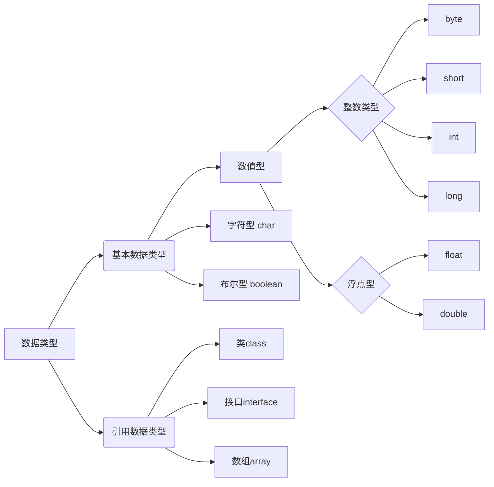

# 基本数据类型

```mermaid
graph LR
A[数据类型] -->B(基本数据类型)
A[数据类型] -->C(引用数据类型)
    B --> d[数值型]
    B --> e[字符型 char]
    B --> f[布尔型 boolean]
    d --> k{整数类型}
    k --> g[byte]
    k --> h[short]
    k --> i[int]
    k --> j[long]
    d --> l{浮点型}
    l --> m[float]
    l --> n[double]
    C --> D[类class]
    C --> E[接口interface]
    C --> F[数组array]
```

