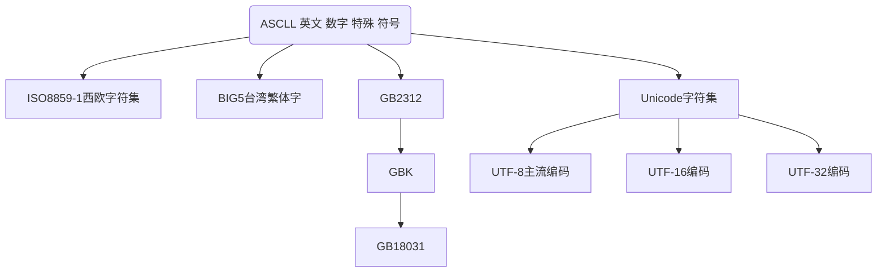

## 字符型

**字符集发展历史**




| **转义符** | **含义**          | **Unicode 值** |
| ---------- | ----------------- | -------------- |
| \b         | 退格（backspace） | \u0008         |
| \n         | 换行              | \u000a         |
| \r         | 回车              | \u000d         |
| \t         | 制表符（tab）     | \u0009         |
| \“         | 双引号            | \u0022         |
| \‘         | 单引号            | \u0027         |
| \\         | 反斜杠            | \u005c         |


```java
/**测试char类型的使用*/
public class TestChar{
    public static void main(String[] args){

        char c1='a';
        char c2='中';
        char c3='\u0061';      //转Unicode字符0061在里面是a
        System.out.println(c1);
        System.out.println(c2);
        System.out.println(c3);

        //java中字符串不是数据类型，而是一个类

        String str="我爱中国";
        System.out.println(str);

        //转义字符
        char c5='\n';
        System.out.println("\'a\'\n\\b\n\"c\"\nd");
      System.out.println("o\tp\tq\tr\tt");     //制表符

    }
}

🏃运行结果：
a
中
a
我爱中国
'a'
\b
"c"
d
o       p       q       r       t
```